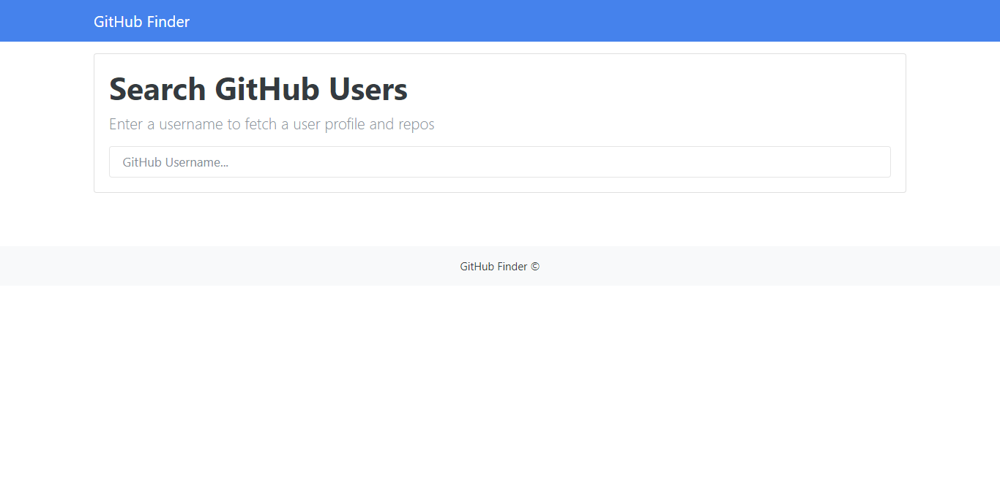

# Github-Finder
Simple project to search about github users and get his profiles and repo and some basic information about them it was an example of using
Public API to fetch data and using asynchronous function like promises and arrow function and async/await 

## Tools
1- HTML

2- BootStrap 

3- JavaScript(Fetch API & ES6)

### Result

